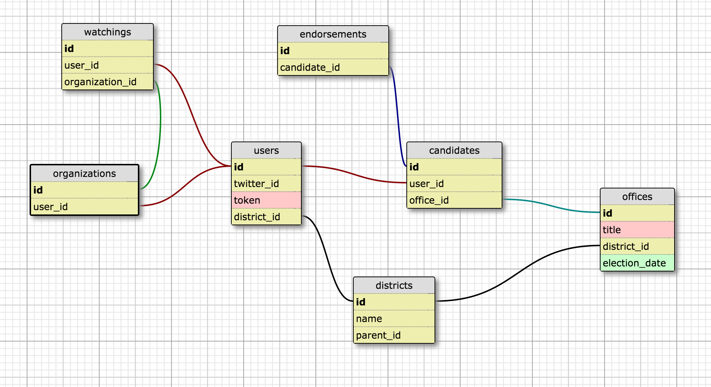

## DBC Final Project Schema - WriteIn

- Schema

- Some logic note
1. Formula for ranking whome to watch
Take Tom's Twitter follower:
count # of endorsements they made
count # of users watching them
ADD THESE #'s TOGETHER

Some Term's to consider
- watch
- follow
- monitor
- track
- subscribe
- share values
- observe
- pocket
- sway